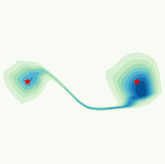

Repository associated with the publication:

 *Adaptive Monte Carlo augmented with normalizing flows*, M. Gabrié, G. Rotskoff and E. Vanden-Eijnden. 

The back-bone of the code is contained in the ``flonaco`` python package. It will help you accelerate sampling of multimodal measures combining traditional Langevin and Real-NVPs normalizing flow trained on the fly.

Concretely, instead of having Langevin walkers stuck in the modes they started of at, as in this Gaussian mixture example (density in pink, walkers trajectory in black):

 

You could learn to jump efficiently form modes to modes of the Gaussian mixture above (learned density in blue and walkers trajectory still in black): 



## Installation

From this root folder, install the package in editable mode by running
```
pip install -e .
```

Then you should be able to run the test
```
python tests/test_gaussian.py
```

## Reproducibility
Experiments in the paper can be reproduced using template codes from the experiments folder. 


